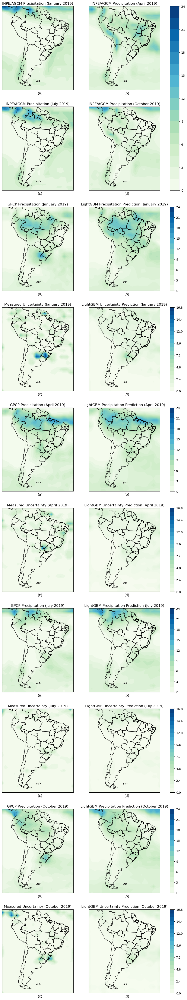

# Machine learning for uncertainty quantification in climate precipitation prediction over South America

This repository contains the reference code for "Machine learning for uncertainty quantification in climate precipitation prediction over South America". The code needs some cleanup, but it works.

## Dependencies

- LightGBM (3.x+)
- Optuna (3.x+)
- Pandas
- PyArrow
- SciTools Iris

To install all dependencies using Conda:

``` sh
conda env create -f environment.yml
```

This code was tested on Anaconda 2022.11 Pop!\_OS 22.04.

# Dataset

The authors use GPCP (Global Precipitation Climate Project) v2, converted from NetCDF to Apache Feather. The dataset can be downloaded [here](https://my.owndrive.com/index.php/s/w7yR5jrPBW8mb7R).

# Training

In the conda environment, run `python train.py`. The training set are the years 1980-2017 with 75%/25% training split.

# Testing

In the conda environment, run `python analysis.py` to generate the resulting maps. Place `agcm.nc` in the root directory, it contains the INPE/AGCM data.

The testing set are the years 2018 and 2019. Maps are generated for selected months (mid-season) of 2019.

# Pre-trained models

Pre-trained models can be downloaded [here](https://my.owndrive.com/index.php/s/w7yR5jrPBW8mb7R). Place them and the Optuna databases inside the `models` folder and they will be used instead of training.

# Results

The figure below shows the precipitation maps along with estimated uncertainties for 4 selected months.



# References

V. S. Monego, J. A. Anochi, H. F. de Campos Velho, South America seasonal precipitation prediction by gradient-boosting machine-learning approach, Atmosphere 13 (2). doi:10.3390/atmos13020243. URL https://www.mdpi.com/2073-4433/13/2/243

J. A. Anochi, R. Hern ́andez Torres, H. F. Campos Velho, Climate Precipitation Prediction with Uncertainty Quantification by Self-configuring Neural Network (International Symposium on Uncertainty Quantification and Stochastic Modelling – 2020), Vol. 2, Ch. 18.

R. F. Adler, G. J. Huffman, A. Chang, R. Ferraro, P.-P. Xie, J. Janowiak, B. Rudolf, U. Schneider, S. Curtis, D. Bolvin, et al., The version-2 global precipitation climatology project (gpcp) monthly precipitation analysis (1979–present), Journal of hydrometeorology 4 (6) (2003) 1147–1167.
